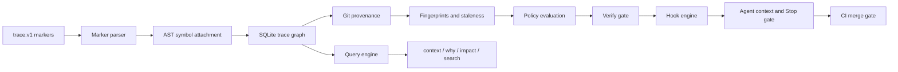

<div align="center">

# TraceLayer

**Agent-native software traceability: intent, implementation, verification, provenance, and evidence as a deterministic graph.**

[](https://github.com/carterlasalle/tracelayer/actions/workflows/trace.yml)
[](https://pypi.org/project/tracelayer/)


[Marker protocol](docs/marker-protocol.md) · [Relationships](docs/relationships.md) · [Concepts](docs/concepts.md) · [Policy](docs/policy.md) · [Hooks](docs/hooks.md) · [Evidence](docs/evidence.md) · [Security](docs/security.md)

</div>

TraceLayer makes the **why** of software traversable. One-line `trace:v1` markers declare the semantic relationships that cannot be derived — which work item produced a behavior, which requirement it satisfies, which tests intend to verify it. The engine derives everything else: AST symbol attachment, Git provenance, revision fingerprints, staleness, and runtime evidence. The result is a continuously verified trace graph that agents and reviewers can query instead of loading the whole repository.

## Quickstart

Install, trace a repository, and get your first answer in under a minute:

```bash
uv tool install tracelayer            # pipx install tracelayer also works

cd your-repo
trace init                            # writes .trace config; appends the invariant to AGENTS.md
trace index --all                     # builds the trace graph
trace verify --all                    # policy check (exit 0 = pass)
trace context <trace-id>              # why does this exist, what verifies it
```

Trace a behavior by adding one line above it:

```python
# trace:v1 id=impl.demo satisfies=REQ-1
def do_the_thing(): ...
```

then `trace index --all` again. Staleness, evidence, hooks, and the CI gate
all build on this. Running `trace` outside a configured repository prints the
`trace init` / `trace install` next steps.

## How it works



Markers are the authoring notation; the graph is the product. Paths, line numbers, commit SHAs, and test results are derived — never written into markers — so trace identity survives refactors and evidence can never silently go stale.

## Capabilities

| Area | What TraceLayer provides |
|---|---|
| Protocol | One-line versioned `trace:v1` grammar, typed semantic edges, stable IDs, deterministic type inference, generated schema docs |
| Indexing | Full and changed-scope indexing, Markdown/YAML artifact extraction, fence-aware marker scanning, honest file-level degradation for unsupported languages |
| Symbols | Tree-sitter attachment for Python, TypeScript, JavaScript, Go, Rust, and Java — markers attach to symbols, never line numbers |
| Graph | SQLite materialized index with declared, structural (`contains`), and observed (`executed`) provenance; FTS5 search; bounded traversal |
| Provenance | Git-derived first-seen/last-modified history, rename tracking, changed-line ranges, dirty-tree status — no commit IDs in source |
| Staleness | Requirement/implementation fingerprints, upstream-change propagation, review states, historical evidence preservation |
| Policy | Four profiles (minimal/standard/strict/safety-critical) across five lifecycles, scoped expiring waivers, deterministic TL-rule registry |
| Query UX | `context`, `why`, `impact`, `search`, `graph` (tree/mermaid/DOT/JSON/JSONL), `status`, `doctor`, `report pr` |
| Hooks | Session start, prompt context, pre-mutation block-once guard, post-mutation guidance, batch summary, fail-closed Stop gate |
| Evidence | JUnit/Cobertura/normalized ingestion, revision binding, L0–L3 proof levels, per-test Python coverage adapter |
| Migration | CodeOps scan/plan/apply with deterministic classification, Scry detection, doctor diagnostics with rename suggestions |
| Audit | Bounded deterministic audit packages for an independent semantic reviewer — no LLM required for the engine itself |

## Usage

### Install

```bash
uv tool install tracelayer            # PyPI; pipx install tracelayer also works
trace --help
```

From a local checkout: `uv tool install .`. From the repository directly:
`uv tool install git+https://github.com/carterlasalle/tracelayer.git`.

Note: macOS ships a built-in `trace` (/usr/bin/trace, Apple Instruments).
This project installs its `trace` binary to `~/.local/bin` — make sure it
precedes `/usr/bin` in your PATH (`which trace` should not print
`/usr/bin/trace`).

The first time you run `trace` outside a configured repository it prints
next steps: `trace init` to enable traceability in the current repo, or
`trace install` to install the skill and hooks into your agent harnesses
globally. Set `TRACE_NO_HINT=1` to silence that message (e.g. in CI).

### Publishing

`tracelayer` is published to PyPI on version tags via trusted publishing
(no tokens stored in CI). Publish a release with:

```bash
git tag v0.1.0 && git push origin v0.1.0
```

Manual publish from a checkout: `uv build && uv publish`. See
`.github/workflows/release.yml` for the one-time PyPI trusted-publisher
setup.

### Prerequisites

- Python `3.12+`
- [`uv`](https://docs.astral.sh/uv/) (dependency management is uv-only; no pip)

```bash
uv sync
uv run trace --help
```

Trace an existing repository:

```bash
uv run trace init --root <repo>          # writes .trace/trace.toml + policy.toml
uv run trace index --root <repo> --all
uv run trace verify --root <repo> --all
uv run trace context --root <repo> <trace-id>
```

Run the full development baseline:

```bash
uv run pytest
uv run ruff check .
uv run trace docs generate --check
```

## Architecture

TraceLayer is a single Python package with deliberately narrow module boundaries:

```text
src/tracelayer/
  cli.py                   Typer CLI; business logic lives in modules
  engine.py                Indexing pipeline, verify, staleness, TraceRepository API
  config.py                trace.toml / policy.toml models and loading
  diagnostics.py           TL-rule registry; every failure carries remediation
  protocol/                Marker grammar, parser, ID rules, ontology, generated schema
  discovery/               File enumeration, ignore logic, monorepo scopes
  artifacts/               Markdown, YAML, and generic file-level extraction
  symbols/                 Tree-sitter parsers and marker-to-symbol attachment
  graph/                   Node/edge models, SQLite store, migrations, traversal, fingerprints
  git/                     Provenance, history, diff-range mapping (argv-array subprocess only)
  evidence/                JUnit, Cobertura, normalized JSON, freshness, proof levels
  policy/                  Profiles, lifecycle, waivers, deterministic rule functions
  query/                   context, why, impact, search
  hooks/                   Event handlers and file-backed session state
  audit/                   Bounded semantic-audit packages and external auditor adapter
  migration/               CodeOps and Scry importers
```

Every module is independently testable; the CLI is a thin shell over the engine.

## Safety model

TraceLayer sits in the coding-agent control loop, so correctness is fail-closed by construction:

- Declared claims are never displayed as proven: a `test -> exercises -> implementation` claim stays unproven until observed execution evidence exists (proof levels L0–L3).
- Derived facts cannot be declared: paths, SHAs, test results, and structural/observed edges are rejected in markers.
- Ambiguity is a diagnostic, never a silent guess: detached markers, unresolved targets, and duplicate IDs are deterministic TL failures with remediation.
- Staleness preserves history: changing a requirement marks downstream review-required; it never deletes evidence.
- Repository text is untrusted data: hooks inject bounded, sanitized summaries; subprocess calls use argv arrays; no `shell=True`.
- Policy can weaken only deliberately: enforcement-file changes surface as TL063 warnings; waivers are scoped, owned, and expiring.
- CI and the Stop gate run the same engine as the CLI — there is no separate enforcement code path.

## Documentation

| Document | Purpose |
|---|---|
| [Concepts](docs/concepts.md) | Three truths, the trace graph, stable IDs, staleness |
| [Marker protocol](docs/marker-protocol.md) | Generated normative `trace:v1` syntax and placement rules |
| [Relationships](docs/relationships.md) | Generated semantic/structural/observed edge semantics |
| [Policy](docs/policy.md) | Profiles, lifecycles, waivers, and the TL-rule catalog |
| [Hooks](docs/hooks.md) | Event model, block-once semantics, injection safety |
| [Evidence](docs/evidence.md) | JUnit/Cobertura ingestion and proof levels L0–L3 |
| [Migration](docs/migration-codeops.md) | CodeOps scan/plan/apply workflow |
| [Security](docs/security.md) | Threat model and mitigations |
| [Large repositories](docs/large-repos.md) | Incremental indexing, monorepo scopes, performance targets |
| [Architecture decisions](docs/adr/) | ADR-0001 through ADR-0008 |

## Installing the agent skill

The canonical skill (canonical layout: `SKILL.md` + `README.md` +
`references/`) lives in [`skills/traceability/`](skills/traceability/README.md)
and is bundled with the installed package. Install it with `trace install`:

```bash
trace install --list                     # detect agents and install state
trace install --agent claude-code        # project scope (.claude/skills)
trace install --agent claude-code --global --yes   # ~/.claude/skills
trace install --yes                      # all detected agents, non-interactive
```

Hooks install for every agent: JSON-merged settings for claude-code
(`.claude/settings.json`) and codex (`.codex/hooks.json`); file-based hook
configs for pi (`.pi/hooks.json` + wrapper), omp (`.omp/hook/hooks.yaml` +
extension gate), and opencode (`opencode.json`) — each with an activation
note (e.g. `pi install npm:@hsingjui/pi-hooks`, `/hooks-trust` in omp).
After upgrading the tool, refresh installed copies with
`trace install --update`. The same skill is installable through the
skills.sh ecosystem:

```bash
npx skills add carterlasalle/tracelayer --agent claude-code
```

For existing repositories, `trace init --skill` copies the skill into
`.agents/skills/traceability/` directly. The same folder is ready for skill
registries (e.g. skills.sh, anthropics/skills) — it follows the standard
layout and links references directly from `SKILL.md`.

## Contributing

TraceLayer uses protected, squash-only pull requests with required checks. Read [CONTRIBUTING.md](CONTRIBUTING.md) before making changes. Run `uv run trace docs generate --check` when editing protocol documentation and `trace verify --changed` before proposing a merge — this repository traces itself.

## License

Apache License 2.0 — see [LICENSE](LICENSE).
